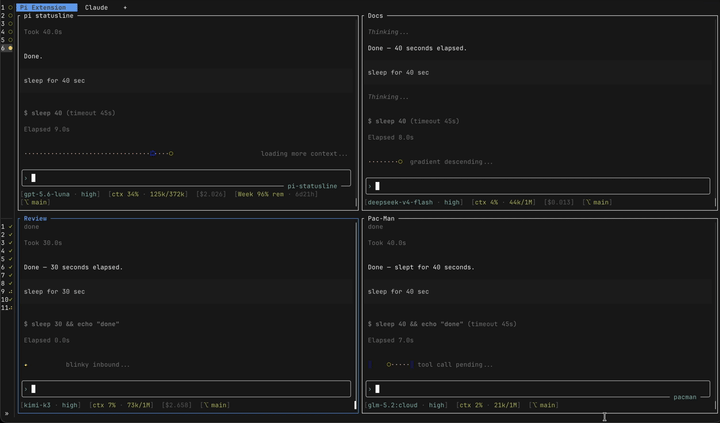

# @smarzban/pi-pacman

Pac-Man **working indicator** for [pi](https://github.com/earendil-works/pi): replaces the streaming spinner with pellet runs, ghost chases, arcade tunnels, and fruit bonuses.

Part of the [pi-extensions](https://github.com/smarzban/pi-extensions) monorepo.



## Highlights

- **Drop-in working indicator**: uses `setWorkingIndicator` / `setWorkingMessage` (normal streaming only)
- **Five looks**: full-width `classic` & `chase`, plus fixed-width `mini`, `arcade`, `fruit` (default 10 cells, configurable)
- **Rotate mode**: cycle short looks every agent message (`/pacman rotate`)
- **Random working blurbs**: arcade + AI/token-flavored lines each run (or lock your own)
- **Remembers your choice**: look, rotate, cells, and custom message in `~/.pi/agent/pacman-thinking.json`

## Quickstart

```bash
pi install npm:@smarzban/pi-pacman
```

Restart pi (or start a new session), send a message, and you should see a yellow `ᗧ` chomping pellets next to the working line:

```text
ᗧ······  waka waka...
```

Default look is **classic** (full-width pellet run). Footer status shows `ᗧ classic` while the extension is active.

The indicator only appears while the agent is **streaming a normal response**, not during compaction/retry loaders.

## Install

| Method | Loads | Command |
|--------|-------|---------|
| **npm** (recommended) | This package only | `pi install npm:@smarzban/pi-pacman` |
| **local path** | This package only | `pi install /absolute/path/to/pi-extensions/packages/pi-pacman` |
| **git** (whole monorepo) | All packages in the repo | `pi install git:github.com/smarzban/pi-extensions` |

For repository-wide installation and package availability, see the [root README](../../README.md).

## Usage

```text
/pacman list
/pacman chase
/pacman rotate
/pacman cells 12
/pacman message chomping tokens...
/pacman off
```

| Command | Result |
|---------|--------|
| `/pacman` | Current look, rotate, cells, message, strip width |
| `/pacman list` | Catalog under the editor |
| `/pacman <look>` | Lock a look (stops rotate) |
| `/pacman rotate` | Cycle short looks every message |
| `/pacman cells [n]` | Fixed-look width (default 10, range 4–40) |
| `/pacman message …` | Lock custom working text (empty = auto-random) |
| `/pacman off` | Hide indicator |

The command table above is the complete `/pacman` reference.

## Looks

| Look | Notes |
|------|--------|
| `classic` | Full-width pellet run (default) |
| `chase` | Full-width Blinky hunt → power pellet → revenge |
| `mini` / `arcade` / `fruit` | Fixed-width animations (**in rotate**); width via `cells` config |

Your selected look, rotation mode, fixed width, and custom message persist in `~/.pi/agent/pacman-thinking.json`.

## Repository docs

- [Package directory and install availability](../../README.md)
- [Local development](../../docs/development.md)
- [Release process](../../docs/releases.md)

## License

[MIT](LICENSE)
