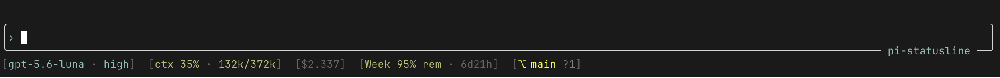

# @smarzban/pi-statusline

Custom **statusline** for [pi](https://github.com/earendil-works/pi): a footer with model/effort, context, provider remaining, git branch, PR, and diff.

Part of the [pi-extensions](https://github.com/smarzban/pi-extensions) monorepo.



## Highlights

- **Session name** `⚑ name` as the leading footer segment
- **Model · effort** from the active model + thinking level
- **Context** as `ctx N% · used/total`: green below 50%, yellow at 50%+, red at 70%+
- **Session cost** `$x.xxx` from assistant `usage.cost.total` when non-zero
- **Tokens/sec** `N t/s` and **time-to-first-token** `ttft …`: speed of the last assistant response, both toggleable (see [Speed segments](#speed-segments))
- **Provider remaining** for **openai-codex**, **opt-in, off by default** (see [Provider usage](#provider-usage))
- **Git** `⎇ branch +staged *unstaged ?untracked` plus ahead/behind; **open PR** via `gh`, clickable in terminals that support links
- **Local by default** with no network calls or token reads unless you enable provider usage

> The rounded editor box with the session-name label moved to its own package:
> [pi-editor](../pi-editor). Install both to get the old look.

## Quickstart

```bash
pi install npm:@smarzban/pi-statusline
# or local
pi install /absolute/path/to/pi-extensions/packages/pi-statusline
```

Restart pi. Name the session so it shows:

```text
/name my task
```

Example (default, no provider-usage segment until you opt in):

```text
[⚑ my task]  [gpt-5-codex · high]  [ctx 12% · 24k/200k]  [$0.042]  [⎇ main +1 *2 ?1]  [#12]
```

After `/statusline usage on`, a Codex quota segment appears: `[5h 80% rem · 4h]`.

The current branch's open PR is checked on startup, branch changes, `/statusline refresh`, and at most once every 30 seconds after an agent run. Its `#number` opens the PR when clicked in terminals that support OSC 8 hyperlinks. Lookups run in the background and never block the editor. Merged or closed PRs disappear automatically after the next check.

## Commands

```text
/statusline               # status + current segments
/statusline on            # enable custom footer (default)
/statusline off           # restore pi’s default footer
/statusline usage on      # opt in to provider quota (reads auth, calls provider)
/statusline usage off     # disable provider quota (default)
/statusline session on    # show the [⚑ name] segment (default)
/statusline session off   # hide the session name segment
/statusline tps on|off    # show/hide the tokens-per-second segment (default on)
/statusline ttft on|off   # show/hide the time-to-first-token segment (default on)
/statusline refresh       # re-fetch git (+ provider usage if enabled) now
```

All settings persist to `~/.pi/agent/statusline.json` (`enabled`,
`usageEnabled`, `sessionName`, `tps`, `ttft`).

## Speed segments

Two numbers describe how fast the last reply was, and they answer different
questions:

- **`ttft` (time to first token)** is the wait before the reply started
  appearing. Think of it as the model "reading your message and thinking"
  before it begins to type. Long ttft = long silent pause. For local models
  this grows with how much conversation the model has to re-read; for cloud
  models it also includes queueing on the provider's side.
- **`t/s` (tokens per second)** is the typing speed once the reply started:
  how many word-pieces (tokens) arrive each second. Higher = the text streams
  in faster. Measured from the first token to the last, so the thinking pause
  above is *not* mixed into it.

So `[42 t/s]  [ttft 2.1s]` reads as: it thought for about 2 seconds, then
typed at 42 tokens a second. Both are measured the way local tools like
Ollama and LM Studio report speed (t/s is the decode-only rate, ttft kept
separate, never blended), so the numbers are comparable to theirs.

Fine print: ttft always reflects the latest response, while t/s reflects the
latest *measurable* one (responses under half a second or with no counted
output keep the previous reading), so after a very short reply the two can
describe different responses. And reasoning models count their thinking as
output tokens whether or not the thinking is streamed, so providers that hide
reasoning can show an inflated t/s: tokens generated during the silent wait
are credited to the typing window.

Hide either with `/statusline tps off` or `/statusline ttft off`.

## Provider usage

**Opt-in and off by default.** With usage off, the statusline reads **no** auth files and makes **no**
network calls. Turn it on with `/statusline usage on`; turn it back off with `/statusline usage off`.

When on, it reads your provider token and calls that provider's usage API:

| Provider id in pi | Remaining / windows | Reads | Sends token to |
|-------------------|---------------------|-------|----------------|
| `openai-codex` | Primary + secondary windows (`% rem` + reset time) | `~/.pi/agent/auth.json` → `openai-codex`, or `~/.codex/auth.json` | `chatgpt.com/backend-api` |

Only your own credentials are used, and the token goes only to that provider. Other providers (xAI,
OpenCode Go, …) have no reliable remaining-% API with pi's credentials, so the segment is omitted for
them even when usage is on.

## Costs

Yes, pi exposes per-assistant-message `usage.cost.total` (USD estimate from model pricing). The footer sums those across the session and shows `$x.xxx` when non-zero. Subscription OAuth turns may still report a computed cost even when you are not billed per-token.

## Install methods

| Method | Loads | Command |
|--------|-------|---------|
| **npm** (recommended) | This package only | `pi install npm:@smarzban/pi-statusline` |
| **local** | This package only | `pi install /absolute/path/to/pi-extensions/packages/pi-statusline` |
| **git** (whole monorepo) | All packages in the repo | `pi install git:github.com/smarzban/pi-extensions` |

See [docs/install](../../docs/install/README.md) for one package vs whole monorepo.

## License

[MIT](LICENSE)
